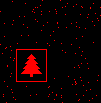

# Day 14 - Restroom Redoubt

> [<- Yesterday](13.md) | [Tomorrow ->](15.md)

An interesting(?) one! 🎄🎄🎄

|      | Part 1 | Part 2 | Total     |
|------|--------|--------|-----------|
| Time | 11:30  | 13:19  | Σ = 24:49 |
| Rank | 783    | 391    | μ = 587   |

## Problem Summary

Robots (given starting position and velocity) move around a grid and wrap around the sides if they go off an edge. For Part 1, after 100 time steps, multiple the number of robots in each quadrant together to get the answer. For Part 2, the robots will form a Christmas tree design when looked at from above. How long does it take for the robots to form the Christmas tree for the first time?

## Part 1

A simllation problem. Easily implemented the robot movements, but had a hard time coming up with the quadrants for some reason. I had several `<=` where there should have been `<` for a few too many minutes.

```python
from helpers.datagetter import aocd_data_in

din, aocd_submit = aocd_data_in(split=True, numbers=True)

for _ in range(100):
    for robot in din:
        robot[0] += robot[2]
        robot[1] += robot[3]

size = (101, 103)

q1, q2, q3, q4 = 0, 0, 0, 0

for robot in din:
    pos = (robot[0] % size[0], robot[1] % size[1])
    if pos[0] < size[0] // 2 and pos[1] < size[1] // 2:
        q1 += 1
    elif size[0] - (size[0] // 2) <= pos[0] and pos[1] < size[1] // 2:
        q2 += 1
    elif pos[0] < size[0] // 2 and size[1] - (size[1] // 2) <= pos[1]:
        q3 += 1
    elif size[0] - (size[0] // 2) <= pos[0] and size[1] - (size[1] // 2) <= pos[1]:
        q4 += 1

aocd_submit(q1 * q2 * q3 * q4)

```

## Part 2

An interesting part two. I don't know what the obvious solution is besides looking at the images?? If this was meant to fool AI, it probably succeeded? I almost crashed my computer using `img.show()` rather than saving them.

Then here's what my life looked like for a few minutes. Notice the occasional blips of a pattern. Will I recognize when it's a Christmas tree?


Until I finally saw this, plain as day!



```python
from helpers.datagetter import aocd_data_in
from PIL import Image
import time

din, aocd_submit = aocd_data_in(split=True, numbers=True)
size = (101, 103)

i = 0
while True:
    img = Image.new("RGB", size)
    for robot in din:
        robot[0] += robot[2]
        robot[1] += robot[3]
        img.putpixel((robot[0] % size[0], robot[1] % size[1]), (255, 0, 0))
    i += 1
    img.save(f"14images/{i}.png")
    if i % 5000 == 0:
        time.sleep(10)

```

## Part 3

Now I am all for throwing off AI, but this one was weird since we had to look for something in the positions which we didn't know what it looked like. I have tried the following on mine and [TJThePieGuy](https://github.com/TJThePiGuy/AdventOfCode/blob/main/2024/notes/14.md)'s inputs and it works, but I had to tune the 0.85 threshold manually for a drop in average distances. This in theory should detect clustering, which is present in the Christmas tree image. However, we didn't even know it would be solid. Maybe it was just an outline? I don't know how to feel about this.

```python
from helpers.datagetter import aocd_data_in
import random
import math

din, aocd_submit = aocd_data_in(split=True, numbers=True)
size = (101, 103)

i = 0
min_avg_dist = float('inf')

def avg_spread(data):
    robots = random.sample(data, len(data))
    dists = 0
    for i in range(len(robots) - 1):
        dists += math.dist(robots[i][:2], robots[i+1][:2])
    return dists / (len(robots)-1)


while True:
    for robot in din:
        robot[0] += robot[2]
        robot[0] %= size[0]
        robot[1] += robot[3]
        robot[1] %= size[1]
        
    i += 1
    dist = avg_spread(din)
    if dist < min_avg_dist:
        if i > 10 and dist / min_avg_dist < 0.85:
            aocd_submit(i)
            exit()
        min_avg_dist = dist
```
