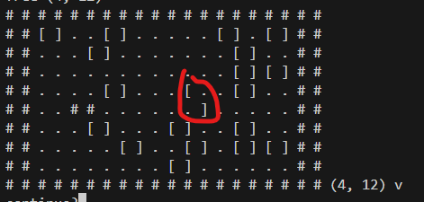

# Day 15 - Warehouse Woes

> [<- Yesterday](14.md) | [Tomorrow ->](16.md)

Wowee, that was a long one. Glad I pushed through it! My evil nemesis [TJ](https://github.com/TJThePiGuy/AdventOfCode/blob/main/2024/notes/15.md)'s lead solidifies, now sitting at 5 points ahead of me in the NJIT leaderboard. (jk, TJ is doing great work and impressively fast!)

|      | Part 1 | Part 2  | Total       |
|------|--------|---------|-------------|
| Time | 17:23  | 1:30:23 | Σ = 1:47:46 |
| Rank | 644    | 2663    | μ = 1654    |

## Problem Summary

You are given a sequence of robot moves (up, right, down, left), the robot's starting position, and boxes inside a walled 2D grid. Boxes can push other boxes, but cannot be pushed through walls. If this is attempted, the robot just stays put. simulate and compute a score based on the final positions of the boxes.

For Part 2, everything was expanded horizontally by 2x, so boxes went from `O` to `[]` and so on. BUT the robot didn't change size. The robot's horizontal movement is 1/2 the width of a box now. This resulted in more complicated pushing logic, particularly in the vertical direction where multiple boxes could be pushed at once. The answer was another score based on the final positions of the boxes.

## Part 1

I did this one relatively quickly, getting 2nd in NJIT. The crux of it is a recursive function that determines whether there is space to push a box (and any box it is pushing), and actually also implements the movement too. So it's all in one! I really don't feel like explaining it.

```python
from helpers.matrix import from_grid
from helpers.datagetter import aocd_data_in

din, aocd_submit = aocd_data_in(split=False, numbers=False)

for i, line in enumerate(din.split()[1:]):
    if line.count("#") == len(line):
        M = from_grid("\n".join(din.split()[0:i+2]))
        break

pos = M.findall('@')[0]
M.set(pos, ".")
moves = "".join(din.split()[i+2:])

dirs = {"<": (0, -1), "^": (-1, 0), ">": (0, 1), "v": (1, 0)}


def movable(pos, dir):
    val_at = M.get(pos)
    if val_at == ".":
        M.set(pos, "O")
        return True
    elif val_at == "#":
        return False

    new_pos = tuple(pos[i] + dir[i] for i in range(2))
    new_val = M.get(new_pos)
    while new_val == "O":
        new_pos = tuple(new_pos[i] + dir[i] for i in range(2))
        new_val = M.get(new_pos)
    if movable(new_pos, dir):
        M.set(pos, ".")
        return True
    return False


for move in moves:
    new_pos = tuple(pos[i] + dirs[move][i] for i in range(2))
    val_at = M.get(new_pos)
    if val_at == "#":
        continue
    elif val_at == "O":
        if movable(new_pos, dirs[move]):
            pos = new_pos
    elif val_at == ".":
        pos = new_pos

ans = 0
for box in M.findall("O"):
    ans += 100 * box[0] + box[1]
aocd_submit(ans)
```

## Part 2

I really *REALLY* don't feel like explaining this one. I left some print statements in to show the absolutely nightmare it was debugging this. In general though, horizontal movement just needed a little tweak to handle the double width boxes, which I implemented by checking if there was space and then shifting everything over by 1.

For vertical movement and the cases when pushing a box which would move another box (eg. pushing the bottom box up in the following example), I had many struggles.

```text
##...[][]...##
##...[][]...##
##....[]....##
```

My first important thought was splitting the logic of horizontal and vertical movements into different functions. This was super helpful. Then for vertical movement, I implemented a very ugly solution that steps through the connected boxes and finds the farthest set, and checks if those can all be moved. If not, nothing is done. However, if they can that means all the ones before them can be moved too since there would be nothing in the way! So I move them, and then silly repeat the same exact process over again until there are no boxes left to move. This could be optimized, but no way am I doing that.

Most of the time loss came in debugging issues like:



And a case like this:

```text
. . . [ . ] . . .
```

Both of which were for different reasons...

I literally was using an `input()` statement to let me step through each of the robot's movements one by one, and as you can see, a dozen print statements to see what in the world the up and down movement logic was doing. Code first, think later! That should be my motto.

It was just a nightmare. I finished 4th and I am just happy that I survived it, did it all by myself, and can finally go to bed. I'm on 2.5 hours of sleep from last night and 13 hours of driving and excited and blessed to be home for Christmas! But I'm so tired. Goodnight!

```python
from helpers.matrix import from_grid
from helpers.datagetter import aocd_data_in

din, aocd_submit = aocd_data_in(split=False, numbers=False)

for i, line in enumerate(din.split()[1:]):
    if line.count("#") == len(line):
        M = from_grid("\n".join(din.split()[0:i+2]).replace("#", "##").replace("O", "[]").replace(".", "..").replace("@", "@."))
        break

pos = M.findall('@')[0]
M.set(pos, ".")
moves = "".join(din.split()[i+2:])
boxes = M.findall('[')[0]

dirs = {"<": (0, -1), "^": (-1, 0), ">": (0, 1), "v": (1, 0)}


def move_lr(pos, dir):
    orig_pos = pos
    while M.get(pos) not in "#.":
        pos = tuple(pos[i] + dir[i] for i in range(2))
    if M.get(pos) == "#":
        return
    
    if dir == (0, -1):
        M.set(pos, "[")
    else:
        M.set(pos, "]")
    pos = tuple(pos[i] - dir[i] for i in range(2))
    while pos != orig_pos:
        if M.get(pos) == "[":
            M.set(pos, "]")
        else:
            M.set(pos, "[")
        pos = tuple(pos[i] - dir[i] for i in range(2))
    M.set(pos, ".")


def check_safe(pos, dir):
    # print("checking", pos, dir)
    
    good = []
    prev = tuple(pos[i] - dir[i] for i in range(2))
    if M.get(pos) == ".":
        if M.get(prev) == "]":
            if M.get((pos[0], pos[1] - 1)) == ".":
                # print("free", pos)
                return [pos]
        elif M.get(prev) == "[":
            if M.get((pos[0], pos[1] + 1)) == ".":
                # print("free", pos)
                return [pos]
        else:
            # print("free", pos)
            return [pos]
    
    if M.get(pos) == "#":
        # print("bad", pos)
        return ["bad"]

    new_pos = tuple(pos[i] + dir[i] for i in range(2))
    # print("new_pos", new_pos)
    if M.get(pos) == "[":
        # print("checking above [")
        # print("checking directly above [", new_pos)
        good.extend(check_safe(new_pos, dir))
        # print("checking right and above ]", (new_pos[0], new_pos[1] + 1))
        good.extend(check_safe((new_pos[0], new_pos[1] + 1), dir))
    elif M.get(pos) == "]":
        # print("checking above ]")
        # print("checking directly above ]", new_pos)
        good.extend(check_safe(new_pos, dir))
        # print("checking left and above ]", (new_pos[0], new_pos[1] - 1))
        good.extend(check_safe((new_pos[0], new_pos[1] - 1), dir))
    # print("checked ahead", good)
    return good


def move_ud(pos, dir):
    locs = check_safe(pos, dir)
    # print(locs)
    while locs:
        if "bad" in locs:
            break
        if locs == [pos]:
            break
        for loc in set(locs):
            from_loc = tuple(loc[i] - dir[i] for i in range(2))
            M.set(loc, M.get(from_loc))
            M.set(from_loc, ".")
        locs = check_safe(pos, dir)
        # print(locs)


for move in moves:
    # print(move)
    new_pos = tuple(pos[i] + dirs[move][i] for i in range(2))
    val_at = M.get(new_pos)
    if val_at == "#":
        continue
    elif val_at in "[]":
        if move in "<>":
            # print("move lr")
            move_lr(new_pos, dirs[move])
            if M.get(new_pos) == ".":
                pos = new_pos
        else:
            # print("move ud", pos)
            move_ud(new_pos, dirs[move])
            if M.get(new_pos) == ".":
                pos = new_pos
    elif val_at == ".":
        pos = new_pos
    # print(M, pos, move)
    # input("continue?")

ans = 0
for box in M.findall("["):
    ans += 100 * box[0] + box[1]
aocd_submit(ans)
```
