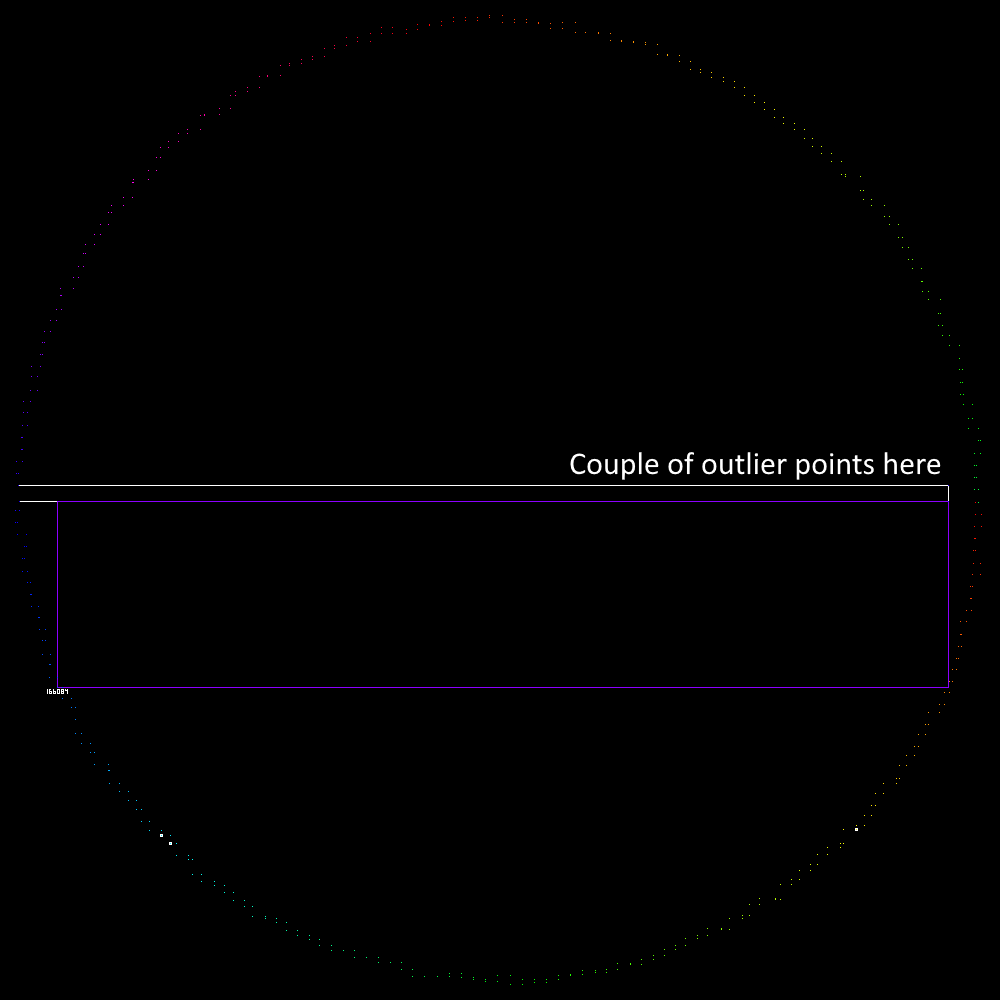
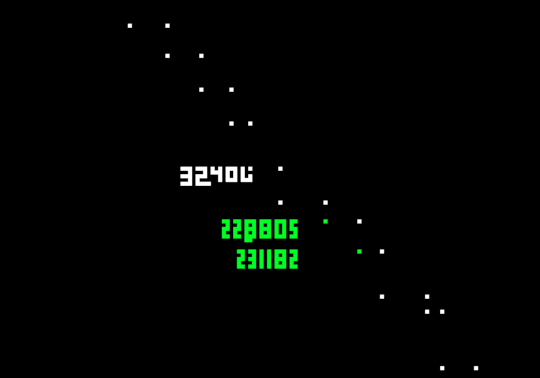

# Day 9 - Movie Theater

> [<- Yesterday](08.md) | [Tomorrow ->](10.md)

Good good good, it's not too late! The sun isn't up yet!

|      | Part One | Part Two | Total   |
|------|----------|----------|---------|
| Time | 3:06     | 2:34:59  | 2:38:05 |

## Part One
Very happy with my Part One time. The code is trivial, but again I am happy with the time.

[Code](../code/09a.py)

```python
from helpers.datagetter import aocd_data_in
import itertools

din, aocd_submit = aocd_data_in(split=True, numbers=True)

ans = 0

for pair in itertools.combinations(din, r=2):
    a, b = pair
    size = (abs(a[0] - b[0]) + 1) * (abs(a[1] - b[1]) + 1)
    ans = max(ans, size)

aocd_submit(ans)
```

## Part Two
Yikers!

I started out with some code that looped over all points in the edges to determine if they were inside the polygon or not, but I really didn't feel like coding that. For the first hour and a half ish I was working on a solution for counting crosses of the polygon's edges for determining whether a given point is inside or not. Reminiscent of [2023 Day 10](https://github.com/R2bEEaton/Advent-of-Code/blob/main/2023/notes/10.md).

But again I really didn't want to figure it out lol.

So I looked at algorithms, but [none](https://journals.ut.ac.ir/article_71280_2a21de484e568a9e396458a5930ca06a.pdf) [seemed](https://kam.mff.cuni.cz/~hansraj/publications/rectangle.pdf) to really do what I wanted... or as easy as I wanted. I even found a Python module, aptly named [largestinteriorrectangle](https://github.com/OpenStitching/lir), but the polygon was too big for it.

So, thought I, let's see what this looks like... with a scale factor of 0.01 of course since a 100k x 100k image would be just a bit overkill...



Oh, saw I, that makes it easy! The largest area rectangle in a circle is a square. So in a hemisphere, it must be about half of the square. So on and on I searched for the biggest rectangles I could find. I knew for sure it was in the bottom half, just because of the way those outliers were positioned.



I used Paint.NET's selection area to guess and check to find the biggest rectangle contained in the shape, and then used the HSL values from the prior image to look up their real (unscaled) coordinates in the output of my Python program. I tried and I tried and all my areas kept getting rejected.

Until, an hour after going down the image route, I re-read the puzzle. Yep, the opposing corners of the rectangle have to be red, or in other words, vertexes! I was looking for the biggest rectangle regardless of where the corners were. Immediately I identified the bottom outlier as necessarily one of the vertices, and then eyeballed and tested a few different points on the opposite side until I found the biggest area. Then I reversed the points using my HSL lookup trick, and that area was the answer!

I'm happy I got it and not too concerned that I didn't use code to spit out the actual answer, but what I am disappointed at is that it took me so long even on the right path, just because of not reading properly. Had I comprehended properly, I may have been done by 1:40:00 or 1:50:00, is my estimate.

Anyways, [TJ](https://github.com/TJThePiGuy), the lead remains yours and, dare I say, may endure.

[Code](../code/09b.py)

```python
from helpers.datagetter import aocd_data_in
from PIL import Image, ImageDraw

din, aocd_submit = aocd_data_in(split=True, numbers=True)

ans = 0

scale = 0.1
img = Image.new("RGB", (1000, 1000), "black")
draw = ImageDraw.Draw(img)

colors = []
for i in range(len(din)):
    hue = int((i % 360))
    colors.append(f"hsl({hue}, 100%, 50%)")

for i, point in enumerate(din):
    x, y = point
    draw.point((x * scale, y * scale), fill=colors[i])
    print(f"Point {i}: {point} -> {colors[i]}")

img.save("output.png")
```