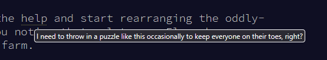

# Day 12 - Christmas Tree Farm

> [<- Yesterday](11.md) | [Tomorrow ->](13.md)

Very odd, very odd.

|      | Part One | Part Two | Total |
|------|----------|----------|-------|
| Time | 22:45    | 0:05     | 22:50 |

## Part One
This was immediately so scary, it seemed like an impossible task. I started researching online for "block puzzle solvers" and read papers, explored graph theory solutions, and so on and so on. Then I figured I might as well get an upper bound by checking the easiest heuristic I could think of: regardless of orientation, arrangement, or even shape of the pieces... does the area given even have enough dang space for all the required pieces?

So I coded the parser (because I was going to have to anyway), ran the check, and found my upper bound. Interesting, the puzzle could have been designed such that all the areas had enough raw space, right? So maybe this was just a way to narrow down the ones to check. Eh, I may as well submit the answer anyway while I look into other things... WAIT THAT WAS IT!?!?!?



Oh.

Kind of feels disappointing slightly, not that I'm not glad it was easy, but like there wasn't (at least as far as I can tell) a fun reason based on the shape of the pieces or anything that allowed this to work. Nah, just constructed to be easily solveable.

Anyways, congrats to [TJ O](https://github.com/TJThePiGuy) for first place in NJIT ACM's leaderboard! Incredible work as usual, good sir.

[Code](../code/12a.py)

```python
from helpers.datagetter import aocd_data_in
import numpy as np

din, aocd_submit = aocd_data_in(split=True, numbers=False)

ans = 0
pieces = []

for line in din:
    if ":" in line and not line.endswith(":"):
        x, y = map(int, line.split(":")[0].split("x"))
        required = map(int, line.split(": ")[1].split(" "))

        area = 0
        for i, count in enumerate(required):
            area += count * sum([sum(x) for x in pieces[i]])

        # Area's big enough for sure
        if x * y >= area:
            ans += 1
        
        continue
    
    if line.endswith(":"):
        new_piece = []
        continue
    elif line == "":
        pieces.append(new_piece)
        continue
    else:
        new_piece.append([0 if c == '.' else 1 for c in line])

aocd_submit(ans)
```

## Part Two
I just clicked the button! And 4x faster than TJ to boot.